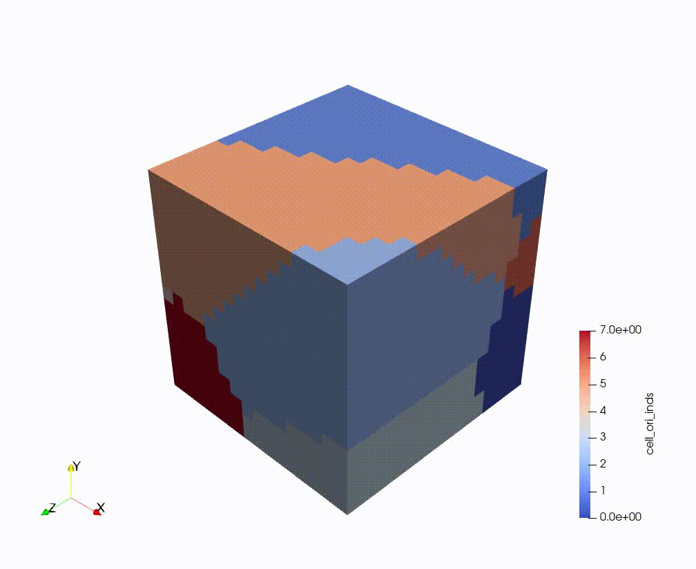
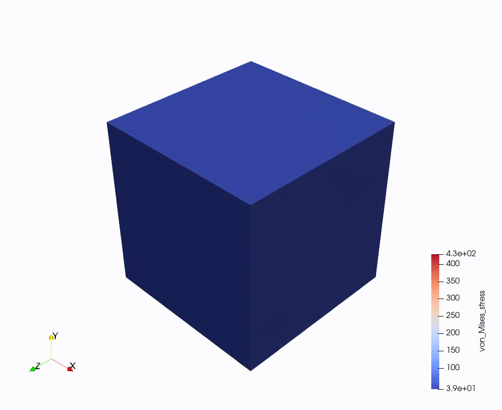
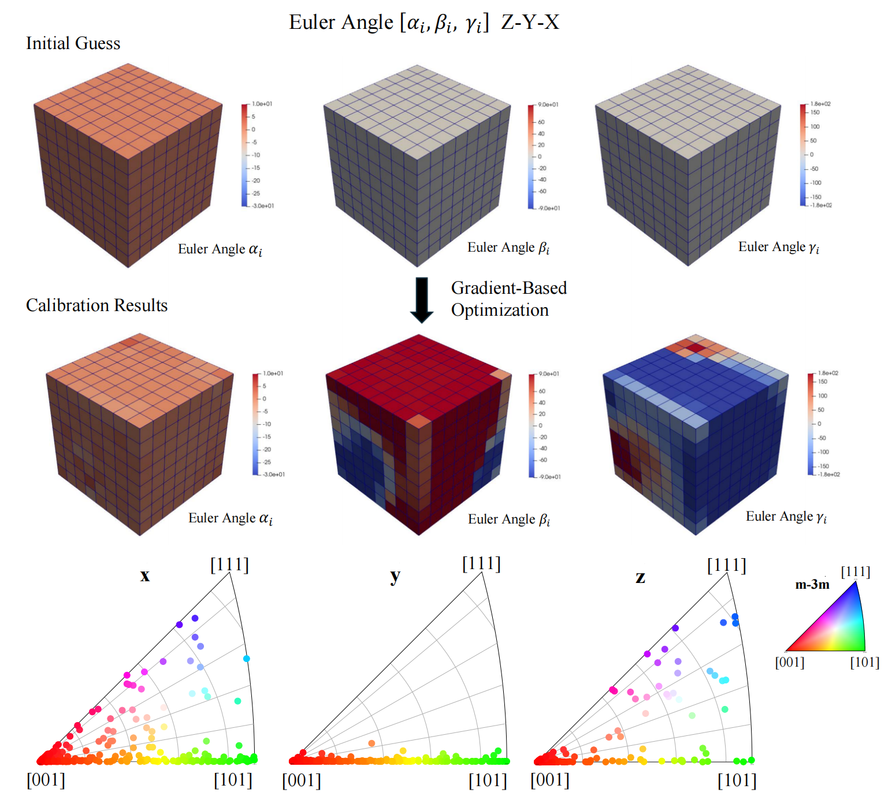
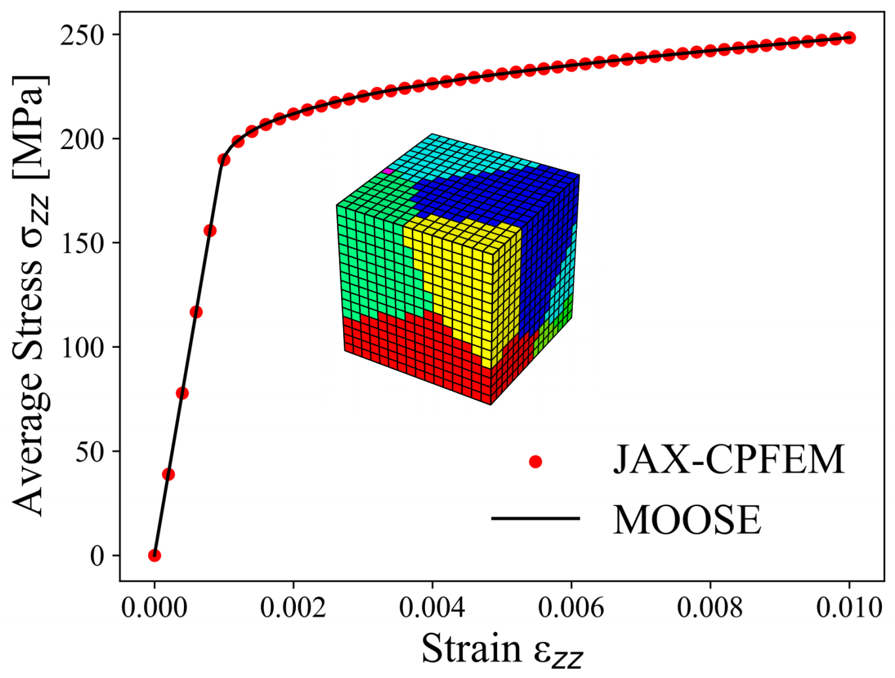

__JAX-CPFEM__: an efficient GPU-computing simulation for differentiable crystal plasticity finite element method (CPFEM), built on top of [JAX-FEM](https://github.com/deepmodeling/jax-fem). Leveraging [JAX](https://github.com/google/jax), this tool addresses the need for inverse design for smart manufacturing. 

## The concept of differentiable CPFEM
We want to emphasize the following three features that differential JAX-CPFEM from other CPFEM software:
- __GPU-acceleration__: Efficient solution to forward CPFEM (involving complicated nonlinear relations) with GPU acceleration based on array programming style and matrix formulation.
- __Automatic Constitutive Laws__: Free to realize different deformation mechanics represented by constitutive materials laws by evaluating the case-by-case Jacobian matrix using automatic differentiation.
- __Automatic Sensitivity__: Differential simulation for sensitivity analysis with respect to design parameters used in single crystal or polycrystal, which can be seamlessly integrated with inverse design.
  
:fire: ***Join us for the development of JAX-CPFEM! This project is under active development!***


## Applications
### Forward simulations
An efficient solution to forward CPFEM with Kalidindi’s hardening law.

:mega: Join us in considering more constitutive laws! No need for deriving the Jacobian matrix by hand!
<p align="middle">
  
  
</p>
<p align="middle">
    <em >Crystal plasticity: 304 steel grain structure (left) and von Mises stress (right).</em>
</p>
<br>

### Gradient-based calibration of CPFEM model parameters with AD‐based sensitivities
:mega: Coming soon!
<br>

### Inverse Design via AD-based sensitivities
Based on the pipeline combining differentiable JAX-CPFEM with gradient-based optimization, here is a demo of the __initial microstructure design__ of a polycrystal metal featuring the targeted mechanical property after applied deformations.<br>
:mega: Join us in structure-processing-microstructure design!


<p align="middle">
  
</p>
<p align="middle">
    <em >Inverse design of the crystal orientation of polycrystalline copper, involving three sequential rotations of Euler angles around the Z, Y, and X axes relative to their initial position.</em>
</p>


## Installation
JAX-CPFEM supports Linux and macOS, which depend on JAX-FEM.
### Install JAX-FEM
JAX-FEM is a collection of several numerical tools, including the Finite Element Method (FEM). See JAX-FEM installation [instructions](https://github.com/deepmodeling/jax-fem?tab=readme-ov-file). Depending on your hardware, you may install the CPU or GPU version of JAX. Both will work, while the GPU version usually gives better performance.

### Install Neper
[Neper](https://neper.info/) is a free/open-source software package for polycrystal generation and meshing. It can be used to generate polycrystals with a wide variety of morphological properties. A good [instruction](https://www.youtube.com/watch?v=Wy9n756wFu4&list=PLct8iNZXls-BMU7aleWoSoxgD8OFFe48W&index=5) video is on Youtube.

### Install JAX-CPFEM
Place the downloaded file in the `applications/` folder of JAX-FEM, and then you can run it.

### Quick Tests
For example, you can download `polycrystal_304steel/` folder and place it in the `applications/` folder of JAX-FEM, run
```bash
python -m applications.polycrystal_304steel.polycrystal_304steel
```
from the root directory. This is a CPFEM example of polycrystal 304 stainless steel under tensile loading. Use [Paraview](https://www.paraview.org/) for visualization.
<p align="middle">
  
</p>
<p align="middle">
    <em >Polycrystal 304 steel (FCC) under tensile loading. A comparison of simulation results between JAX-CPFEM (point) and MOOSE (line).</em>
</p>

## Tutorial
Tutorial video coming soon!

## Citations
If you found this library useful in academic or industry work, we appreciate your support if you consider starring the project on Github.
